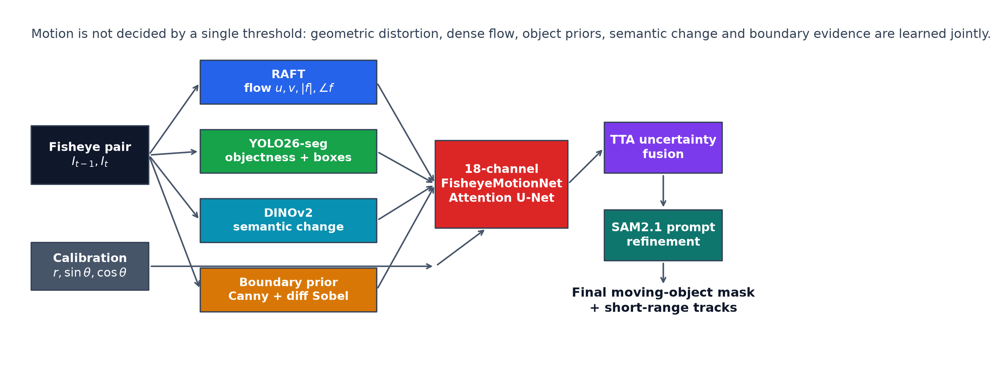
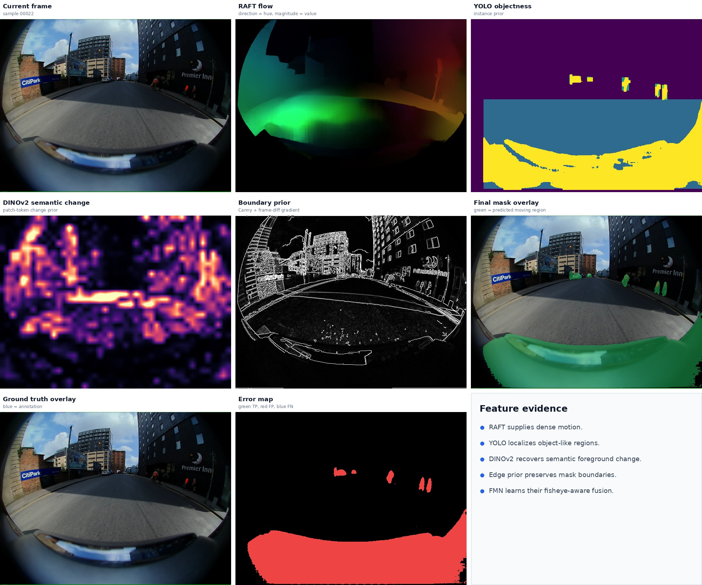
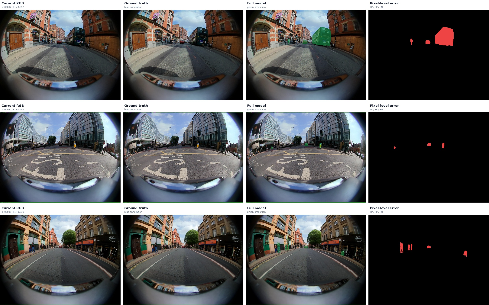
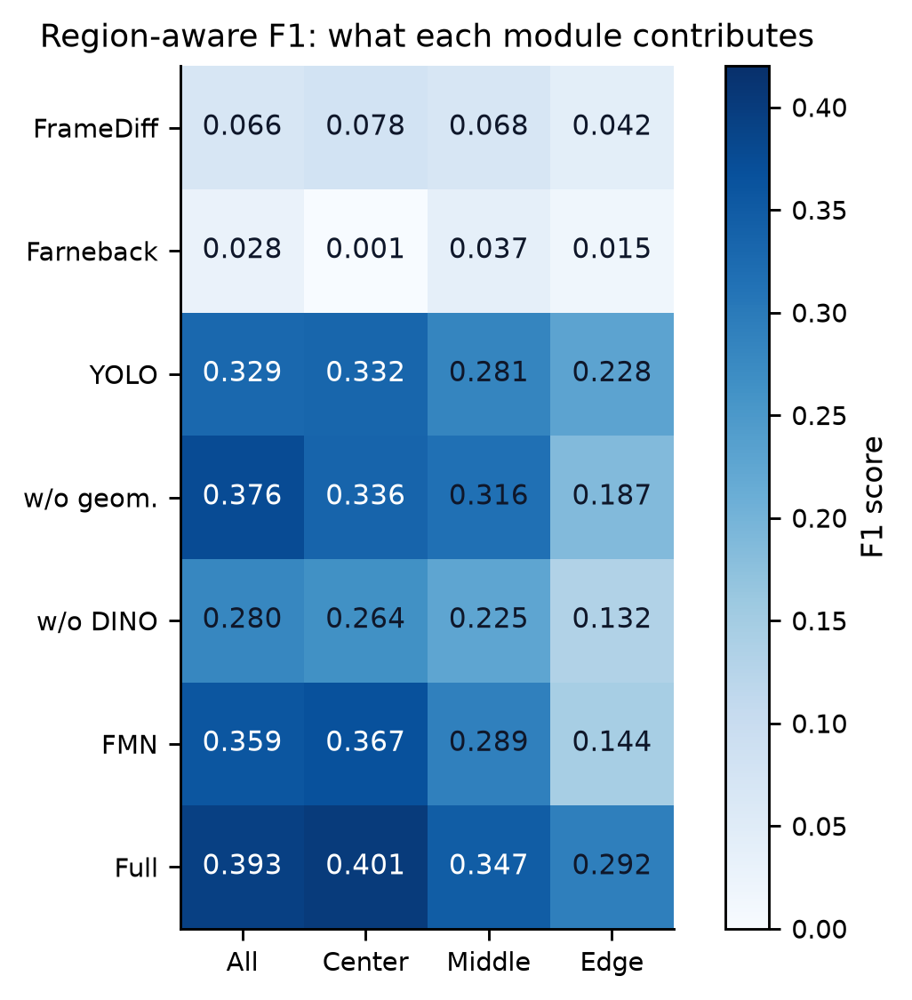
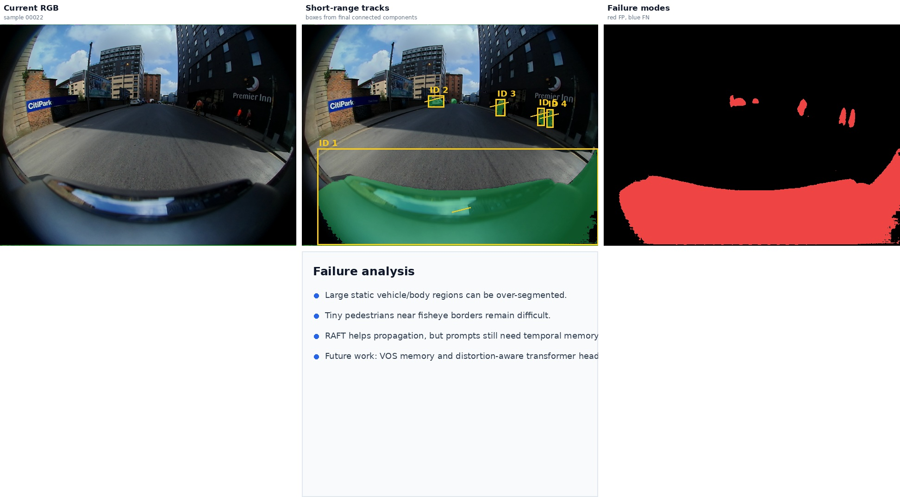

# FisheyeMotion Paper Report

This Markdown file is the GitHub preview companion for the polished LaTeX report.
The canonical paper-style source is:

- `docs/paper/main.tex`
- `docs/paper/references.bib`
- `docs/paper/README.md`

Build with:

```bash
cd docs/paper
xelatex main.tex
bibtex main
xelatex main.tex
xelatex main.tex
```

## Core Figures

### Architecture



### Deep Evidence Panel



### Qualitative Results



### Region-Aware Ablation



### Tracking and Failure Analysis



## Headline Result

The final model `Full-RAFT-YOLO-DINO-FMN-SAM2` reaches:

| IoU | Precision | Recall | F1 | Center F1 | Middle F1 | Edge F1 |
| --- | --- | --- | --- | --- | --- | --- |
| 0.3131 | 0.3613 | 0.5830 | 0.3932 | 0.4012 | 0.3471 | 0.2915 |

Compared with weak motion-only or instance-only baselines, the final model is stronger because it fuses dense motion, objectness, semantic change, fisheye geometry, boundary evidence, uncertainty-aware fusion, and SAM2.1 prompt refinement.
