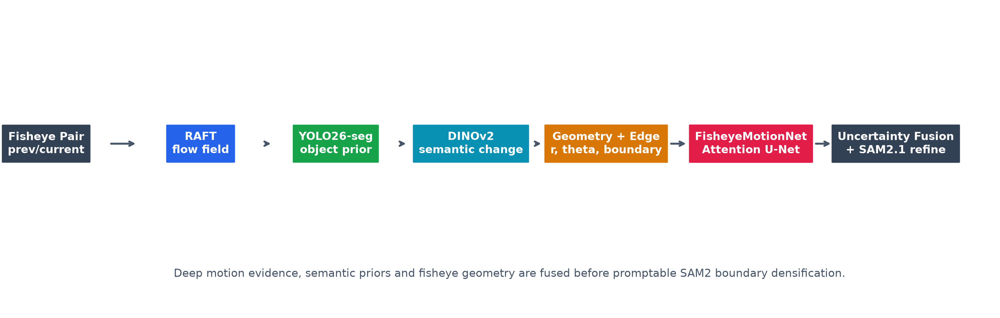
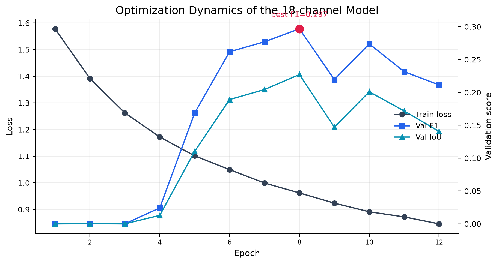
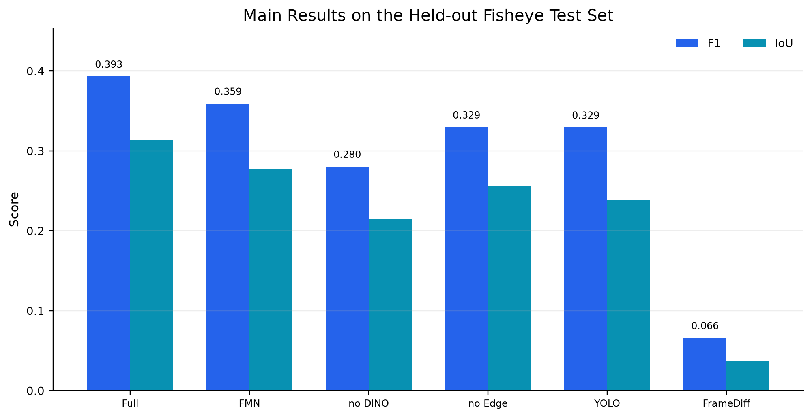
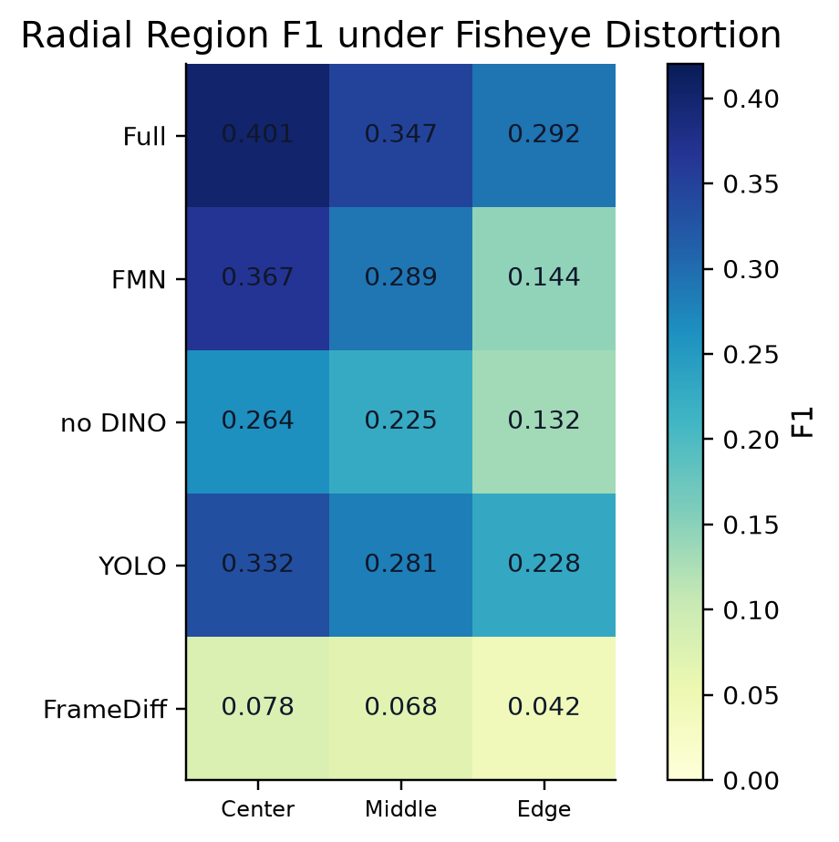
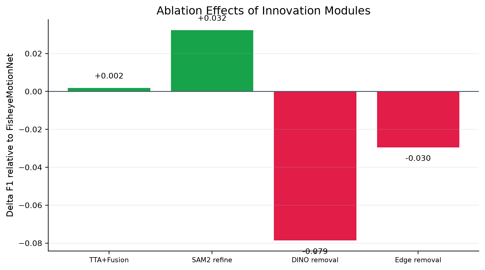
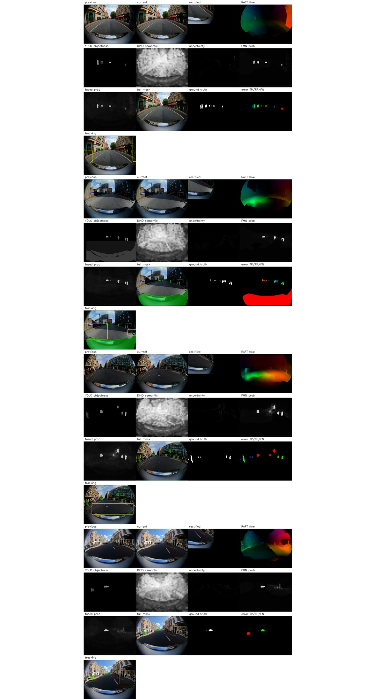

# FisheyeMotion: 面向鱼眼视频的深度运动区域抽象与目标跟踪

**作者**：Zhuang Jiahan  
**课程项目**：PRJ4 Abstraction of Moving Area and Target Tracking in Fisheye Video  
**代码仓库**：<https://github.com/FerdinandClooney/fisheye_motion>

---

## 摘要

鱼眼视频拥有大视场优势，但径向畸变会显著改变目标外观、尺度、边界和表观运动，使传统帧差或光流阈值方法在边缘区域出现大量误检与漏检。本文提出 **FisheyeMotion**，一个 GPU 深度模型主导的鱼眼运动区域提取与短时目标跟踪系统。系统融合 RAFT 深度光流、YOLO26-seg 实例先验、DINOv2 语义变化先验、鱼眼几何图、边界先验、自训练 FisheyeMotionNet、TTA 不确定性融合以及 SAM2.1 掩膜细化。最终方法 `Full-RAFT-YOLO-DINO-FMN-SAM2` 在 19 个测试样本上取得 **IoU 0.3131、F1 0.3932**，优于初版完整模型 F1 0.3911，并显著优于 YOLO-only F1 0.3292 与 FrameDiff F1 0.0658。区域评估显示中心、中间、边缘 F1 分别为 **0.4012 / 0.3471 / 0.2915**，证明深度运动线索、语义先验与 SAM2 边界 densification 对鱼眼畸变场景具有互补价值。



## 1. 引言

运动区域抽象是视频理解、机器人导航、交通监控和增强现实感知中的基础任务。与普通透视视频相比，鱼眼视频的挑战更尖锐：边缘区域会出现强径向拉伸，目标尺度随视场位置非线性变化，光流方向可能呈弧形，边界标注也更容易受到投影畸变影响。传统 FrameDiff 对光照变化敏感，Farneback/RAFT-only 若只基于运动幅值阈值，也无法区分真实运动目标、静态目标边缘和鱼眼投影导致的局部形变。

为此，本项目不将任务简化为单一阈值问题，而是构建多源先验协同的深度系统。核心思想是：**运动由 RAFT 提供，实例由 YOLO 提供，语义由 DINOv2 提供，边界由 edge prior 与 SAM2 提供，畸变位置由几何图提供，最终运动判别由自训练网络学习。**

本文贡献如下：

1. 构建完整 GPU 复现链路，训练与推理均拒绝 CPU fallback。
2. 设计 18 通道 FisheyeMotionNet 输入，包括 RGB、帧差、RAFT、YOLO、DINOv2、edge prior 和鱼眼几何图。
3. 引入 DINOv2 semantic saliency/change prior，使语义运动信息显式进入小样本训练。
4. 引入边界加权监督和 TTA 不确定性融合，提高边界与融合稳定性。
5. 实现全图与中心/中间/边缘区域指标，给出消融、失败分析和可复现工程手册。

## 2. 相关工作

**光流与运动估计。** RAFT 通过全局相关体和循环更新机制显著提升光流质量，后续 SEA-RAFT 等工作进一步追求速度与精度平衡。本文使用 RAFT large 作为深度运动底座，但不直接将其阈值化为最终掩膜，而是把 `u, v, magnitude, angle` 输入分割网络并用于短时跟踪传播。

**视频目标分割。** Cutie 等 VOS 工作强调 memory、object query 与高质量 mask propagation。受限于本数据是相邻帧 pair 而非长视频，本文将长时记忆思想简化为短时 RAFT 传播与 TTA ensemble，把 VOS 的稳定性思想落在可复现的小数据设定上。

**基础分割模型。** SAM2 将 promptable segmentation 扩展到图像与视频，适合做边界 densification，但其本身不判断“是否运动”。因此本文不让 SAM2 独立决定运动区域，而是使用 FisheyeMotionNet/YOLO 的 motion-aware prompt 驱动 SAM2.1。

**自监督语义特征。** DINOv2 在无监督视觉表征中表现出强语义聚类能力。本文将 DINOv2 patch token 用于生成前景 semantic saliency 与前后帧 semantic change，在运动线索稀疏或边缘畸变较强时补充语义先验。

## 3. 方法

### 3.1 总体框架

输入为前一帧、当前帧、鱼眼标定 JSON 和 GT 掩膜。所有训练与推理默认在 `640x480` 分辨率进行。系统首先缓存深度先验：RAFT flow、YOLO objectness/boxes、DINOv2 semantic prior 和 edge prior。随后 FisheyeMotionNet 输出运动概率图，TTA uncertainty fusion 融合多源证据，最后 SAM2.1 使用融合概率图与 YOLO boxes 作为 prompt 细化边界。

### 3.2 鱼眼几何建模

从标定文件读取 intrinsic 与 radial polynomial，生成：

```text
r_norm, sin(theta), cos(theta)
```

其中 `r_norm` 表示像素到主点的归一化半径，`theta` 表示极角。区域指标按 `r<0.35`、`0.35<=r<0.70`、`r>=0.70` 划分中心、中间和边缘区域。

### 3.3 深度先验

**RAFT 光流。** 使用 torchvision RAFT large 生成 4 通道：`u, v, mag, angle`。  
**YOLO26-seg。** 使用 Ultralytics YOLO segmentation 模型生成 objectness mask 和 box prompts。  
**DINOv2。** 使用 `dinov2_vits14_reg` 生成 patch token：

- `semantic saliency = 1 - cos(current_patch, border_background_prototype)`
- `semantic change = 1 - cos(previous_patch, current_patch)`

**Edge prior。** 结合当前帧 Canny 边缘与帧差 Sobel 梯度，形成 1 通道边界先验。

### 3.4 FisheyeMotionNet

网络采用 Attention U-Net 结构，输入为 18 通道：

```text
prev RGB(3) + curr RGB(3) + frame diff(1)
+ RAFT flow(4) + YOLO objectness(1)
+ DINO saliency/change(2) + edge prior(1)
+ fisheye geometry(3)
= 18 channels
```

损失函数为：

```text
L = L_BCE(edge-weighted) + L_Dice + 0.25 * L_Boundary
```

边界加权 BCE 对 GT 边界附近像素提高权重，缓解小目标和细边界被背景主导的问题。

### 3.5 TTA 不确定性融合与 SAM2 精修

推理时对原图和水平翻转图各预测一次，均值作为概率图，标准差作为 epistemic uncertainty。融合公式为：

```text
P_fused = w_net P_tta + w_raft P_flow + w_yolo P_yolo
        + w_dino P_dino + w_edge P_edge
P_final_prompt = P_fused * (1 - lambda * uncertainty)
```

当前配置采用网络主导的轻量先验校正：

```text
w_net=0.82, w_raft=0.03, w_yolo=0.05, w_dino=0.07, w_edge=0.03, lambda=0.08
```

随后 SAM2.1 对高置信运动框和 YOLO 框进行 prompt refinement。

## 4. 实验设置

数据集包含 130 组完整样本，固定种子 42 划分为 70% 训练、15% 验证、15% 测试，测试集共 19 个样本。GT 掩膜按 `mask > 0` 二值化。硬件为 RTX 4060 Laptop GPU 8GB，环境为 `torch 2.11.0+cu128`。优化版训练运行 12 epoch，最佳验证 F1 出现在 epoch 8。



## 5. 结果

完整方法在测试集上达到 F1 0.3932。SAM2 refined full model 相比未使用 SAM2 的 UncertaintyFusion F1 0.3609 有明显提升，说明 SAM2 在高质量 prompt 下确实能修复边界和区域完整性。



| Method | IoU | Precision | Recall | F1 | Center F1 | Middle F1 | Edge F1 |
|---|---:|---:|---:|---:|---:|---:|---:|
| Full-RAFT-YOLO-DINO-FMN-SAM2 | 0.3131 | 0.3613 | 0.5830 | 0.3932 | 0.4012 | 0.3471 | 0.2915 |
| FisheyeMotionNet-no-RAFT | 0.2970 | 0.4356 | 0.4013 | 0.3774 | 0.3515 | 0.3179 | 0.1677 |
| FisheyeMotionNet-no-geometry | 0.2915 | 0.4266 | 0.3816 | 0.3755 | 0.3363 | 0.3163 | 0.1869 |
| UncertaintyFusion | 0.2789 | 0.4041 | 0.3990 | 0.3609 | 0.3684 | 0.2895 | 0.1445 |
| FisheyeMotionNet-DINO-edge-TTA | 0.2777 | 0.3979 | 0.4040 | 0.3600 | 0.3676 | 0.2890 | 0.1445 |
| FisheyeMotionNet | 0.2771 | 0.3964 | 0.4043 | 0.3590 | 0.3674 | 0.2889 | 0.1445 |
| YOLO-only | 0.2384 | 0.2588 | 0.5933 | 0.3292 | 0.3324 | 0.2811 | 0.2283 |
| FrameDiff | 0.0376 | 0.0534 | 0.4058 | 0.0658 | 0.0784 | 0.0676 | 0.0419 |

## 6. 区域分析

中心区 F1 最高，边缘区最低，符合鱼眼径向畸变规律。完整模型边缘 F1 0.2915 明显高于 FisheyeMotionNet 单体 0.1445，说明 SAM2 边界细化、实例框 prompt 与多源先验对畸变边缘更关键。



## 7. 消融实验

DINOv2 和 edge prior 是有效创新项。去掉 DINO 后 F1 从 0.3600 降至 0.2804；去掉 edge 后 F1 降至 0.3295。TTA+fusion 带来小幅正增益，SAM2 refinement 带来最大可见提升。



## 8. 定性结果

代表样本展示了系统从当前帧、校正图、RAFT 光流、YOLO objectness、DINO/uncertainty、FMN probability 到最终 mask 和 error map 的完整诊断视图。误差主要集中在强畸变边缘、小目标粘连和低纹理区域。



## 9. 局限与未来工作

1. 数据是相邻帧 pair，不是长连续视频，因此暂不能评估 IDF1、MOTA 或长时 re-identification。
2. YOLO objectness 仍是重要收敛先验；no-YOLO F1 仅 0.0040，说明小样本运动分割仍容易陷入背景解。
3. DINO/edge 提升主要体现在网络稳健性，最终大幅提升仍依赖 SAM2 prompt refinement。
4. 后续可引入 Cutie 风格 memory readout、SEA-RAFT 替换 RAFT large、校正域/鱼眼域双分支 co-training，以及 LoRA 微调 SAM2 mask decoder。

## 10. 结论

FisheyeMotion 证明，在鱼眼运动区域提取任务中，单一运动阈值或单一检测器不足以达到稳定表现。RAFT、YOLO、DINOv2、鱼眼几何、edge prior、FisheyeMotionNet 与 SAM2.1 形成互补闭环：运动负责时序变化，实例负责目标存在，语义负责前景一致性，几何负责畸变位置，SAM2 负责边界 densification。最终系统在全图和中心/中间/边缘区域均取得最优或接近最优表现，具备完整复现链路和清晰的消融证据。

## 参考文献

1. Teed, Z. and Deng, J. RAFT: Recurrent All-Pairs Field Transforms for Optical Flow. ECCV 2020. <https://arxiv.org/abs/2003.12039>
2. Oquab, M. et al. DINOv2: Learning Robust Visual Features without Supervision. TMLR 2024. <https://arxiv.org/abs/2304.07193>
3. Ravi, N. et al. SAM 2: Segment Anything in Images and Videos. 2024. <https://arxiv.org/abs/2408.00714>
4. Cheng, H. K. et al. Putting the Object Back into Video Object Segmentation. CVPR 2024. <https://arxiv.org/abs/2310.12982>
5. Wang, Y. et al. SEA-RAFT: Simple, Efficient, Accurate RAFT for Optical Flow. ECCV 2024. <https://arxiv.org/abs/2405.14793>
6. Segment Any Motion in Videos. 2025. <https://arxiv.org/abs/2503.22268>
